# Οδηγός ιδιοκτήτη καταλύματος — Delivr

Για τον ιδιοκτήτη ή τον διαχειριστή του καταλύματος. Σε 5 λεπτά θα ξέρεις
τι είναι το QR, πού μπαίνει, και **ακριβώς τι βλέπει ο επισκέπτης σου** όταν το
σκανάρει.

Οι εικόνες είναι από πραγματικές παραγγελίες στο live περιβάλλον: μία delivery
από τη `Villa Aegean Blue` (QR **AEGEAN1**) και μία take away από το
`Sunset Apartment 2A` (QR **SUNSET2A**).

---

## 1. Τι είναι το QR

Κάθε κατάλυμα έχει **δικό του μοναδικό QR code** και δικό του κωδικό
(π.χ. `AEGEAN1`). Όταν ο επισκέπτης το σκανάρει, ανοίγει στο κινητό του μια
σελίδα που **ξέρει ήδη πού βρίσκεται**:

- ξέρει τη διεύθυνση, οπότε δεν του ζητάει να την πληκτρολογήσει·
- δείχνει **μόνο τα καταστήματα που όντως παραδίδουν εκεί**·
- δείχνει τα σωστά μεταφορικά και την ελάχιστη παραγγελία για τη ζώνη σου.

Δεν χρειάζεται εφαρμογή, εγγραφή ή κωδικός. Ανοίγει με τον browser του κινητού.

> **Δεν είναι κατάλογος.** Αν κάποιος πληκτρολογήσει σκέτο το delivr URL χωρίς
> QR, βλέπει μόνο αυτό:
>
> 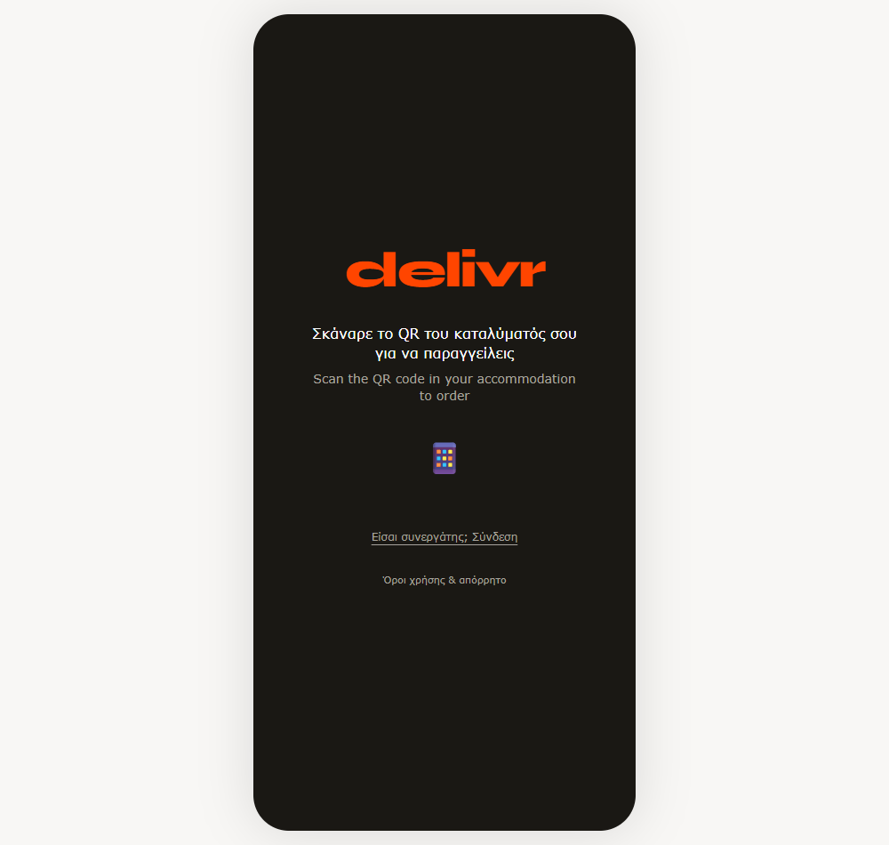
>
> Δηλαδή ο μόνος τρόπος να παραγγείλει κανείς είναι από το QR του δωματίου —
> γι' αυτό η τοποθέτησή του έχει σημασία.

---

## 2. Πού το τυπώνεις και πού το βάζεις

Το QR το κατεβάζεις ή το τυπώνεις από την πλατφόρμα (Καταλύματα & QR → εικονίδιο
🔳 δίπλα στο κατάλυμα): PNG για δική σου σχεδίαση, ή έτοιμη κάρτα με το όνομα του
καταλύματος, τον κωδικό και σύντομες οδηγίες.

**Πού δουλεύει καλύτερα:**

- 🛏️ Στο **κομοδίνο** ή στο γραφείο του δωματίου — το νούμερο ένα σημείο.
- 🍽️ Στο **τραπέζι της κουζίνας** ή στον πάγκο.
- 📖 Μέσα στο **welcome book** / φάκελο υποδοχής.
- ❄️ Με μαγνητάκι στο **ψυγείο**.
- 🚪 Πίσω από την **πόρτα εισόδου**, μαζί με τις οδηγίες WiFi.

**Πρακτικές συμβουλές:**

- Τύπωσέ το **τουλάχιστον 5×5 cm** — μικρότερο δυσκολεύει τα παλιά κινητά.
- Πλαστικοποίησέ το ή βάλε το σε σταντ: αντέχει υγρασία και ηλιοφάνεια.
- Βάλε μια **κοντή φράση δίπλα** («Φαγητό στο δωμάτιο — σκάναρε εδώ»), γιατί ένα
  σκέτο QR χωρίς εξήγηση δεν το σκανάρει κανείς.
- Δίπλα στο WiFi password είναι το σημείο με τη μεγαλύτερη προσοχή στο δωμάτιο.
- **Μη φωτοτυπείς το QR άλλου καταλύματος** — κάθε κωδικός στέλνει την παραγγελία
  σε διαφορετική διεύθυνση.

Αν ένα QR αποσυρθεί ή γραφτεί λάθος, ο επισκέπτης βλέπει καθαρό μήνυμα και τα
στοιχεία επικοινωνίας υποστήριξης — δεν μένει σε λευκή οθόνη:

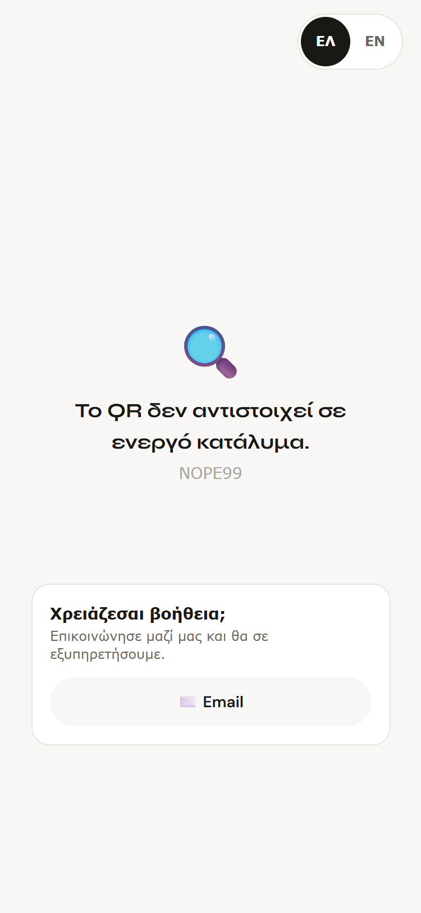

---

## 3. Τι βλέπει ο επισκέπτης — βήμα προς βήμα

### Βήμα 1 · Σκανάρει → βλέπει το κατάλυμά του και τα καταστήματα

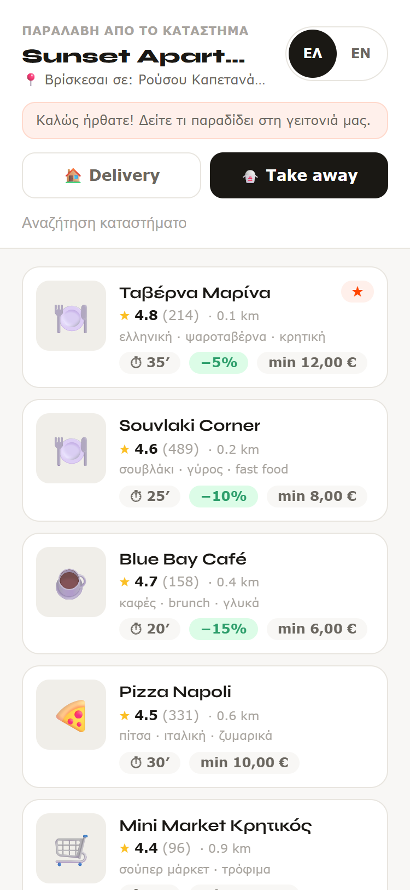

Επάνω το όνομα και η διεύθυνση του καταλύματος, το μήνυμα καλωσορίσματος (αν έχεις
ορίσει), και οι δύο καρτέλες **🏠 Delivery / 🥡 Take away**. Κάθε κατάστημα δείχνει
βαθμολογία, απόσταση, χρόνο, μεταφορικά και ελάχιστη παραγγελία.

Η γλώσσα αλλάζει με το κουμπί **ΕΛ / EN** πάνω δεξιά και ακολουθεί την προτιμώμενη
γλώσσα του καταλύματος την πρώτη φορά.

> Στο **Take away** η επικεφαλίδα αλλάζει σε «Παραλαβή από το κατάστημα» και
> «Βρίσκεσαι σε …» — γιατί εκεί δεν παραδίδεται τίποτα στο κατάλυμα. Τα
> μεταφορικά μηδενίζονται και εμφανίζεται η έκπτωση take away, αν το κατάστημα
> δίνει.

### Βήμα 2 · Ανοίγει το μενού

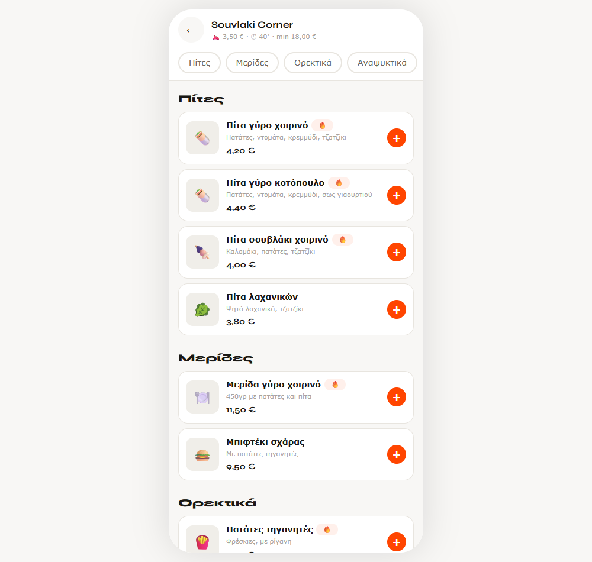

Το μενού είναι χωρισμένο σε κατηγορίες με chips για γρήγορη μετακίνηση. Τα μη
διαθέσιμα προϊόντα εμφανίζονται γκρι και δεν παραγγέλνονται.

### Βήμα 3 · Διαλέγει extras και γράφει σχόλιο

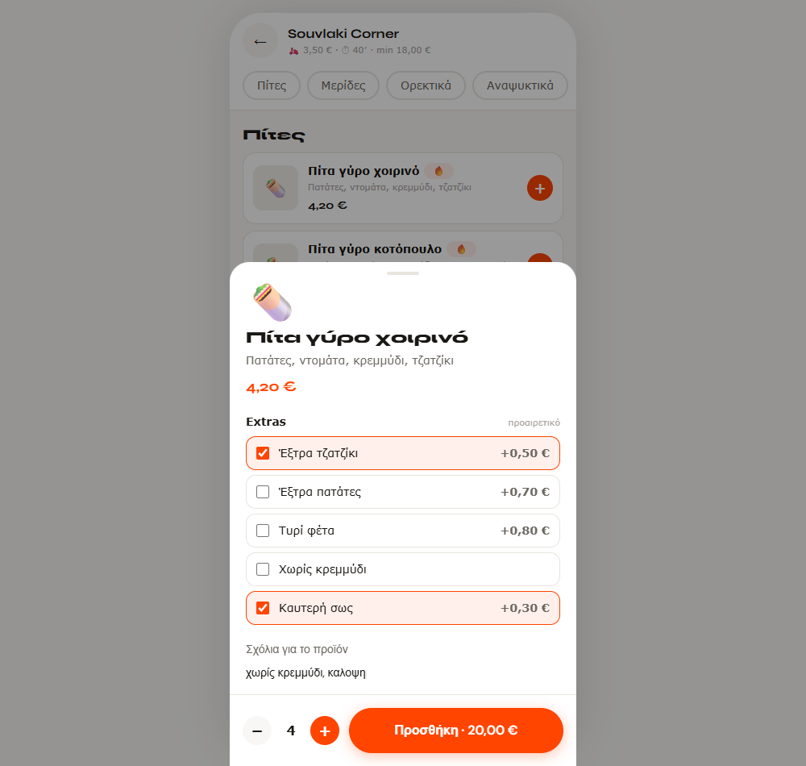

Ανοίγει φύλλο από κάτω με τις επιλογές του καταστήματος (Extras, μεγέθη κ.λπ.),
πεδίο «Σχόλια για το προϊόν» και ποσότητα. **Η τιμή στο κουμπί ενημερώνεται
ζωντανά** όσο τσεκάρει extras.

### Βήμα 4 · Το καλάθι του λέει τι λείπει

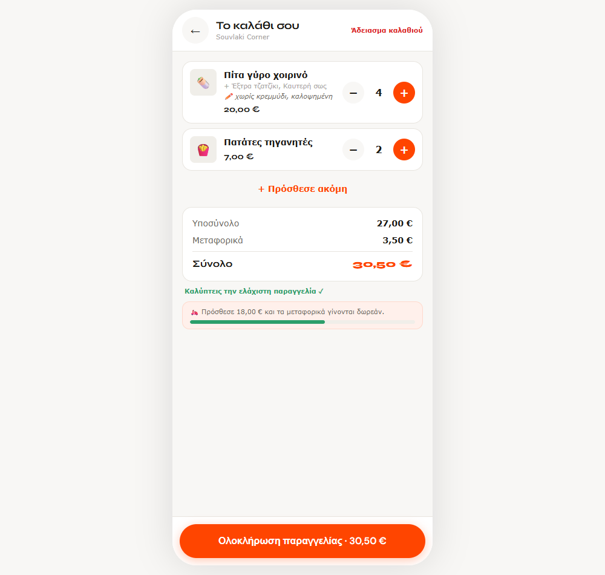

Υποσύνολο, μεταφορικά, σύνολο — και δύο ενδείξεις:

- **Ελάχιστη παραγγελία**: όσο δεν καλύπτεται, το κουμπί ολοκλήρωσης είναι
  κλειδωμένο και μια μπάρα δείχνει πόσο λείπει.
- **Δωρεάν μεταφορικά**: πόσο ακόμη χρειάζεται για να μηδενιστούν — καθαρό
  κίνητρο για μεγαλύτερο καλάθι.

### Βήμα 5 · Ολοκληρώνει χωρίς λογαριασμό

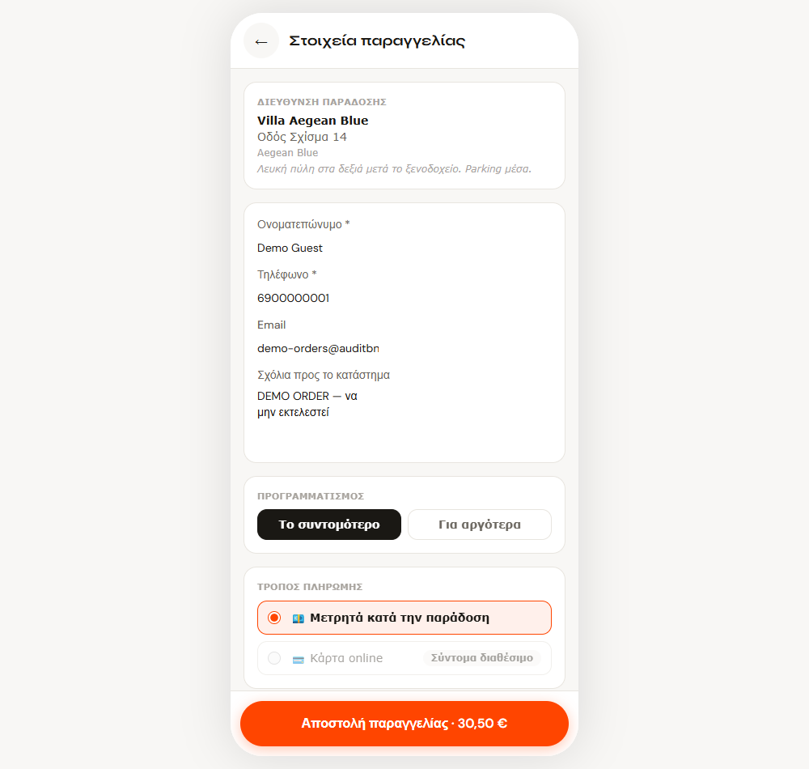

Ζητούνται **μόνο**: ονοματεπώνυμο, τηλέφωνο, προαιρετικό email και σχόλια προς το
κατάστημα. Η διεύθυνση συμπληρώνεται μόνη της από το κατάλυμα — μαζί με όροφο,
κουδούνι και σημειώσεις πρόσβασης, ώστε ο διανομέας να βρει την πόρτα.

Υπάρχει επίσης πεδίο **«Κωδικός έκπτωσης»** και επιλογή «Το συντομότερο / Για
αργότερα» για προγραμματισμένη παραγγελία.

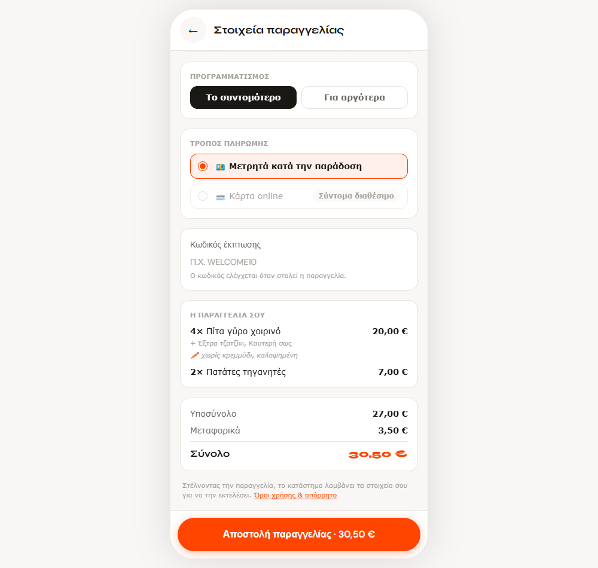

Πριν το κουμπί αποστολής βλέπει **αναλυτικά κάθε προϊόν** με τα extras, τα σχόλια
και την τιμή του — τελευταία ευκαιρία να εντοπίσει λάθος.

> 💳 **Δεν ζητείται ποτέ κάρτα.** Η πληρωμή είναι μετρητά κατά την παράδοση ή την
> παραλαβή, απευθείας στο κατάστημα.

### Βήμα 6 · Παρακολουθεί την παραγγελία ζωντανά

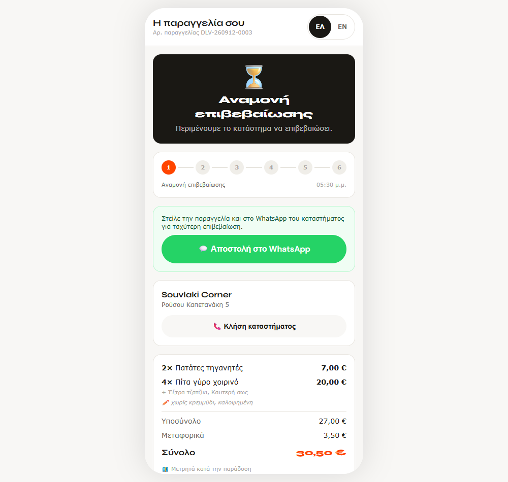

Μόλις σταλεί, ο επισκέπτης πάει σε έναν **προσωπικό σύνδεσμο παρακολούθησης**.
Βλέπει κατάσταση, εκτιμώμενο χρόνο, ιστορικό σταδίων με ώρες, και κουμπί κλήσης
του καταστήματος. Όσο η παραγγελία είναι σε αναμονή, έχει και κουμπί αποστολής
στο WhatsApp του καταστήματος για γρηγορότερη επιβεβαίωση.

Κάθε φορά που το κατάστημα πατάει το επόμενο στάδιο, η σελίδα του αλλάζει μόνη
της:

| Στάδιο | Τι βλέπει |
| --- | --- |
| Αναμονή επιβεβαίωσης | [εικόνα](screenshots/track-a-01-pending.png) |
| Επιβεβαιώθηκε | [εικόνα](screenshots/track-a-02-confirmed.png) |
| Ετοιμάζεται | [εικόνα](screenshots/track-a-03-preparing.png) |
| Έτοιμη | [εικόνα](screenshots/track-a-04-ready.png) |
| Καθ’ οδόν | [εικόνα](screenshots/track-a-05-on-the-way.png) |

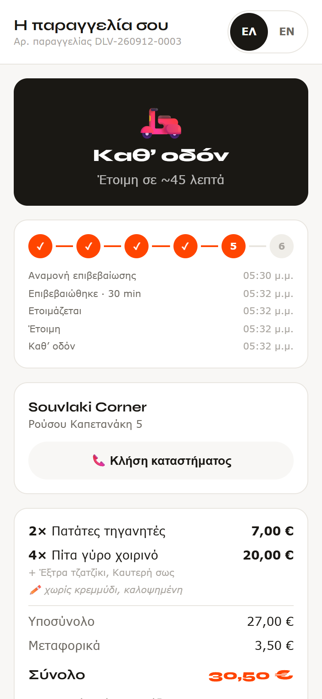

> Ο σύνδεσμος δουλεύει και αργότερα — αξίζει να του πεις να τον κρατήσει.

---

## 4. Delivery και Take away — η διαφορά

| | 🏠 Delivery | 🥡 Take away |
| --- | --- | --- |
| Επικεφαλίδα | «Παράδοση σε <κατάλυμα>» | «Παραλαβή από το κατάστημα» |
| Διεύθυνση | το κατάλυμά σου | η διεύθυνση του καταστήματος |
| Μεταφορικά | ανά ζώνη, δωρεάν πάνω από ποσό | 0 € |
| Έκπτωση | — | συχνά έκπτωση take away (π.χ. −10%) |
| Στάδια | … → Έτοιμη → **Καθ’ οδόν** → Παραδόθηκε | … → Έτοιμη → Παραλήφθηκε |

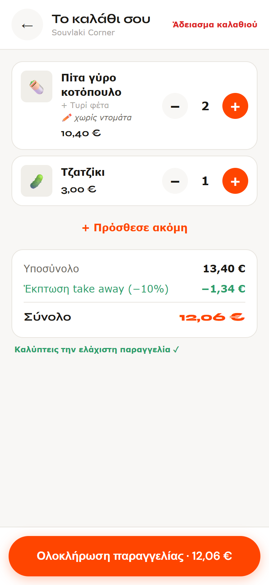

---

## 5. Συχνές ερωτήσεις επισκεπτών

**«Χρειάζεται να κατεβάσω εφαρμογή;»** Όχι. Ανοίγει στον browser.

**«Πρέπει να φτιάξω λογαριασμό;»** Όχι. Μόνο όνομα και τηλέφωνο ανά παραγγελία.

**«Πώς πληρώνω;»** Μετρητά κατά την παράδοση ή την παραλαβή, στο κατάστημα.

**«Γιατί δεν βλέπω κάποιο κατάστημα;»** Είτε είναι κλειστό αυτή την ώρα, είτε δεν
παραδίδει στη διεύθυνση του καταλύματος.

**«Τι γίνεται με τα στοιχεία μου;»** Πηγαίνουν μόνο στο κατάστημα, αποκλειστικά
για να εκτελεστεί η παραγγελία. Αναλυτικά στους
[Όρους χρήσης & απόρρητο](screenshots/public-02-terms.png) που είναι προσβάσιμοι
από κάθε οθόνη.

---

## 6. Checklist πριν δεχτείς επισκέπτες

- [ ] Το QR είναι τυπωμένο, πλαστικοποιημένο και σε **ορατό** σημείο.
- [ ] Υπάρχει μια φράση δίπλα που εξηγεί τι είναι.
- [ ] Σκάναρα **εγώ** το QR και είδα το σωστό όνομα καταλύματος.
- [ ] Εμφανίζονται καταστήματα και στο Delivery και στο Take away.
- [ ] Τα στοιχεία του καταλύματος (όροφος, κουδούνι, οδηγίες πρόσβασης) είναι
      συμπληρωμένα — αυτά φτάνουν στον διανομέα.
- [ ] Το μήνυμα καλωσορίσματος λέει κάτι χρήσιμο.
