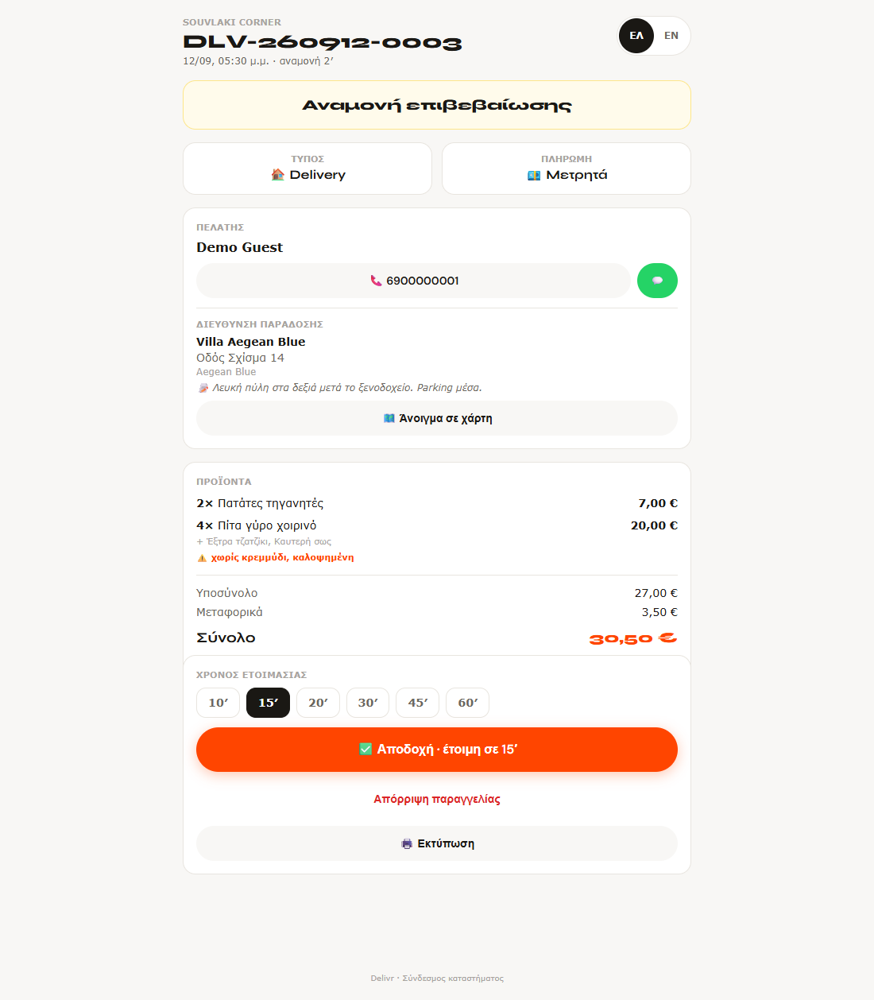
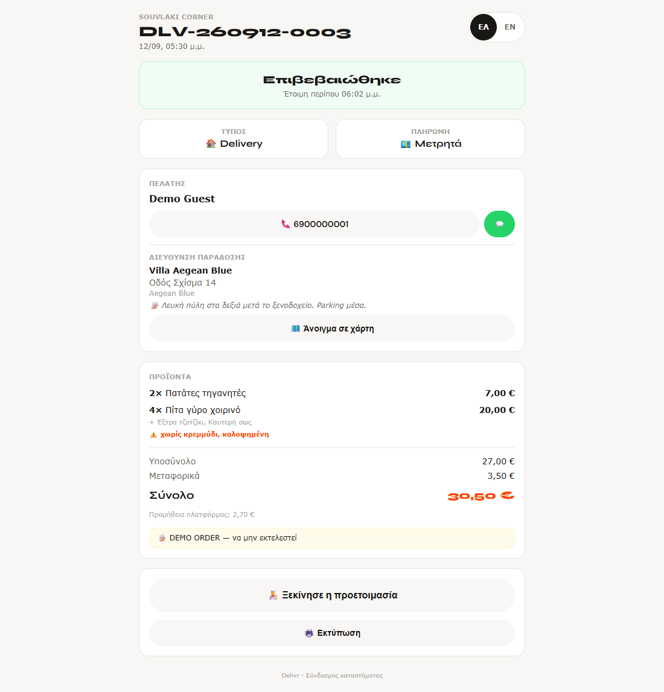
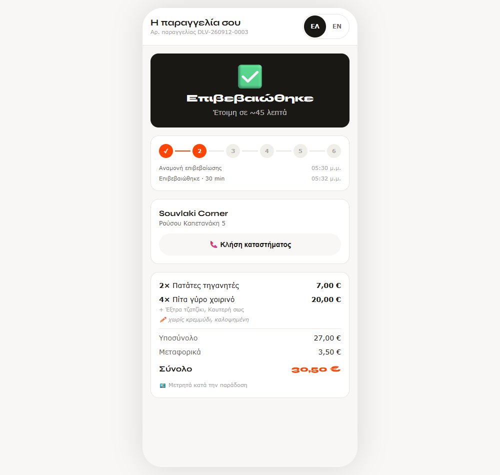
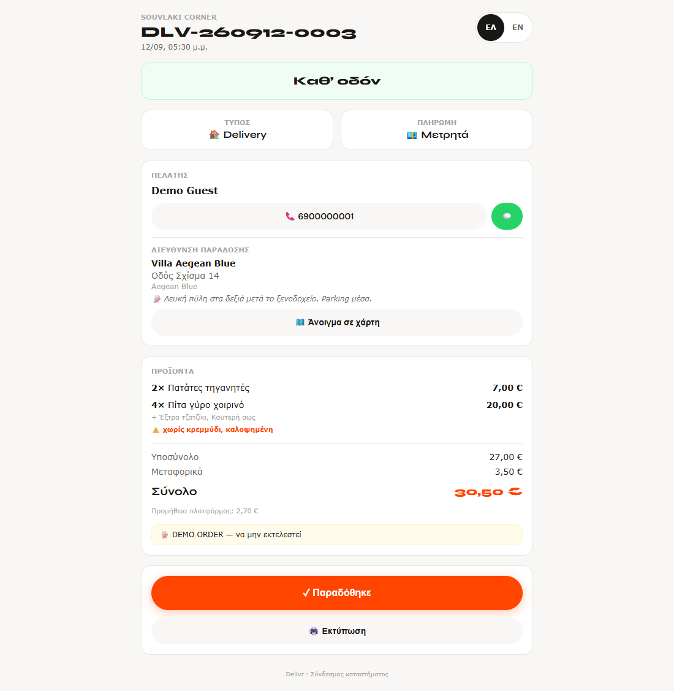
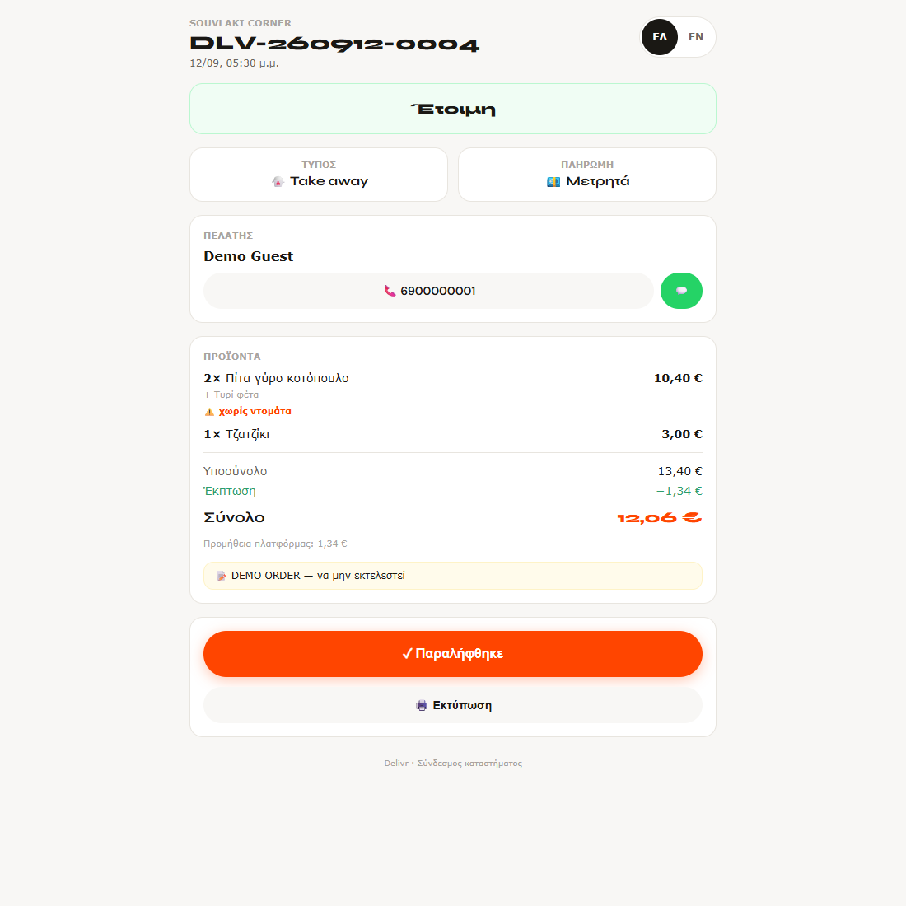
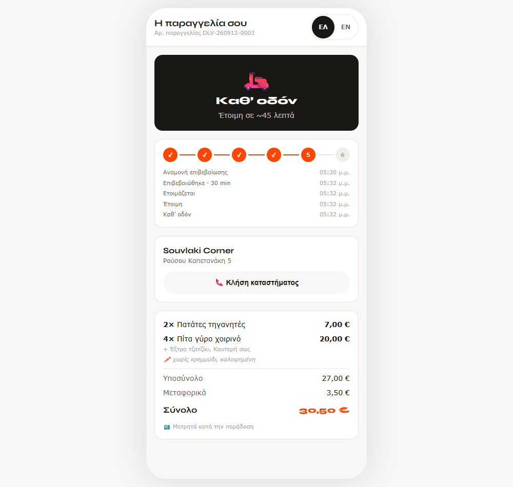
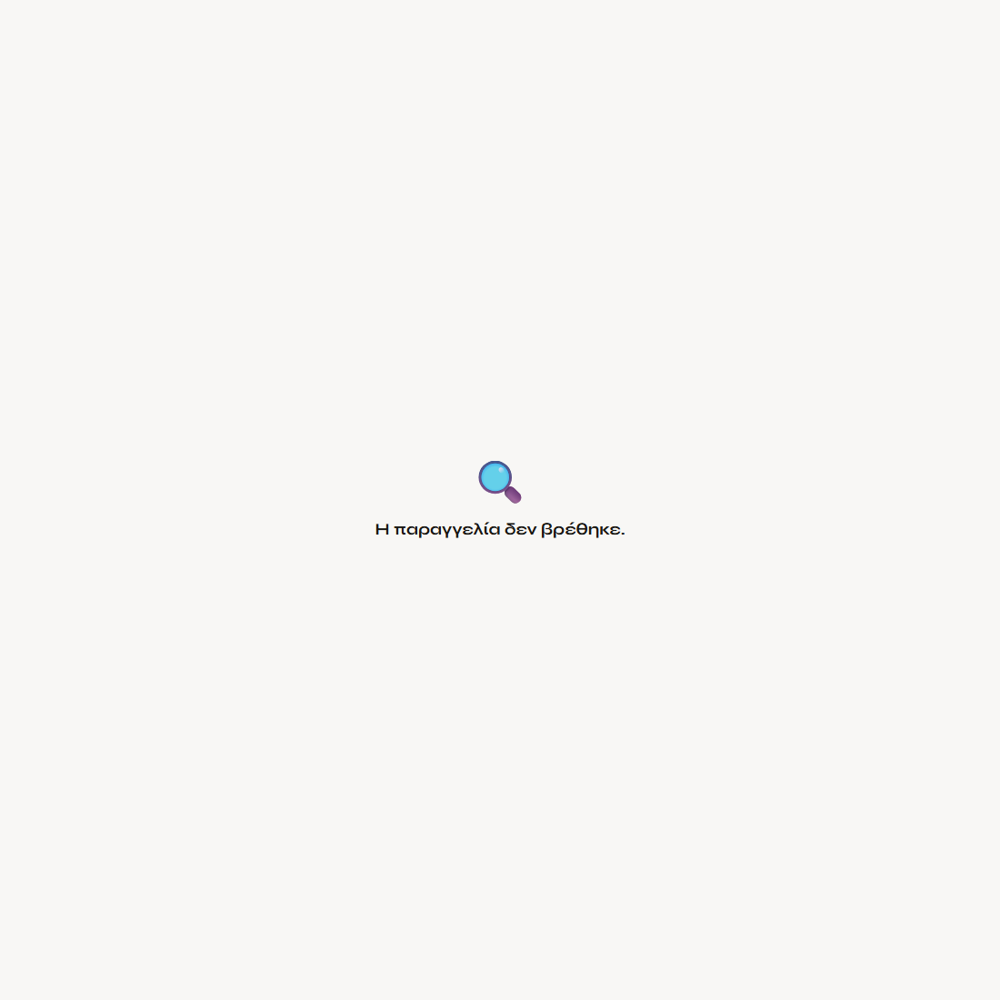

# Οδηγός καταστήματος — Delivr

Για τον υπεύθυνο του καταστήματος. **Δεν χρειάζεσαι λογαριασμό, εφαρμογή ή
εγκατάσταση.** Κάθε παραγγελία φτάνει σαν σύνδεσμος· τον ανοίγεις από το κινητό,
το tablet ή τον υπολογιστή του μαγαζιού και δουλεύεις από εκεί.

Όλες οι εικόνες του οδηγού είναι από **πραγματικές παραγγελίες** στο live
περιβάλλον (`DLV-260912-0003` delivery και `DLV-260912-0004` take away).

---

## 1. Πώς φτάνει η παραγγελία

Τη στιγμή που ο πελάτης πατάει «Αποστολή παραγγελίας» ξεκινούν **δύο** κανάλια
ταυτόχρονα:

| Κανάλι | Τι είναι | Πού το βλέπεις |
| --- | --- | --- |
| **Email** | Email στο «Email παραγγελιών» του καταστήματος με όλα τα στοιχεία και κουμπί **«Άνοιγμα & επιβεβαίωση»** | στα εισερχόμενά σου |
| **WhatsApp** | Ο ίδιος ο πελάτης βλέπει κουμπί «Αποστολή στο WhatsApp» με έτοιμη τη σύνοψη | στο WhatsApp του μαγαζιού |

Και τα δύο οδηγούν στην **ίδια σελίδα**: τον προσωπικό σύνδεσμο της παραγγελίας
(`/s/<κωδικός>`). Ο σύνδεσμος είναι μοναδικός ανά παραγγελία και δεν απαιτεί
κωδικό πρόσβασης — γι' αυτό μην τον προωθείς σε τρίτους.

> 💡 Πρόσθεσε τον αποστολέα του email στις επαφές σου ώστε να μην πέφτει στα
> ανεπιθύμητα. Το WhatsApp λειτουργεί σαν δεύτερη ειδοποίηση όταν το email αργεί.

---

## 2. Τι βλέπεις όταν ανοίξεις τον σύνδεσμο



Από πάνω προς τα κάτω:

1. **Όνομα καταστήματος & αριθμός παραγγελίας** (`DLV-260912-0003`), με την ώρα
   που ήρθε και **πόσα λεπτά περιμένει ο πελάτης**.
2. **Κίτρινη μπάρα «Αναμονή επιβεβαίωσης»** — όσο είναι κίτρινη, κανείς δεν έχει
   απαντήσει ακόμη.
3. **Τύπος & πληρωμή**: `🏠 Delivery` ή `🥡 Take away`, και `💶 Μετρητά`.
   Η πληρωμή είναι πάντα μετρητά — εισπράττεις εσύ ολόκληρο το ποσό.
4. **Πελάτης**: όνομα, κουμπί κλήσης και πράσινο κουμπί WhatsApp.
5. **Διεύθυνση παράδοσης** (μόνο στο delivery): κατάλυμα, οδός, όροφος/κουδούνι,
   σημειώσεις πρόσβασης και κουμπί **«Άνοιγμα σε χάρτη»** που ανοίγει απευθείας
   στις συντεταγμένες του καταλύματος.
6. **Προϊόντα** με τα extras κάτω από κάθε γραμμή και τα σχόλια του πελάτη με
   ⚠️ πορτοκαλί — αυτά είναι τα «χωρίς κρεμμύδι» που πρέπει να δει η κουζίνα.
7. **Σύνολα** και, αφού απαντήσεις, η **προμήθεια πλατφόρμας** (πληροφοριακά —
   δεν αφαιρείται από την είσπραξη, τιμολογείται ξεχωριστά).
8. Το γενικό σχόλιο της παραγγελίας σε κίτρινο πλαίσιο.

Η σελίδα ανανεώνεται **μόνη της**: δεν χρειάζεται να κάνεις refresh.

---

## 3. Αποδοχή ή απόρριψη

### Αποδοχή με χρόνο ετοιμασίας

Στο κάτω μέρος διαλέγεις **10′ – 60′** και πατάς `✅ Αποδοχή · έτοιμη σε …′`.



Η μπάρα γίνεται **πράσινη «Επιβεβαιώθηκε»** και δείχνει την ώρα που υπολόγισε το
σύστημα. Ο πελάτης το βλέπει στο κινητό του **αμέσως**:



> 💡 Ο χρόνος που δίνεις είναι η υπόσχεσή σου. Καλύτερα ρεαλιστικός παρά
> αισιόδοξος — από αυτόν βγαίνει το «Έτοιμη σε ~X λεπτά» που διαβάζει ο πελάτης.

### Απόρριψη με λόγο

Αν δεν μπορείς να την εκτελέσεις, πάτα **«Απόρριψη παραγγελίας»** και διάλεξε
λόγο: *Πολύς φόρτος · Εξαντλήθηκε προϊόν · Εκτός ζώνης παράδοσης · Κλείνουμε ·
Άλλο* (ή γράψε δικό σου σχόλιο). Ο πελάτης ενημερώνεται αμέσως και δεν περιμένει
άδικα. **Μια απορριμμένη παραγγελία δεν ξανανοίγει.**

---

## 4. Τα στάδια μέχρι την παράδοση

Μετά την αποδοχή εμφανίζεται κάθε φορά **ένα και μόνο κουμπί** — το επόμενο βήμα.
Δεν μπορείς να μπερδευτείς.

### Delivery

```
Αναμονή → Επιβεβαιώθηκε → Ετοιμάζεται → Έτοιμη → Καθ’ οδόν → Παραδόθηκε
```

| Πατάς | Η παραγγελία γίνεται | Εικόνα |
| --- | --- | --- |
| `👨‍🍳 Ξεκίνησε η προετοιμασία` | Ετοιμάζεται | [Ετοιμάζεται](screenshots/store-a-03-preparing.png) |
| `🥡 Έτοιμη` | Έτοιμη | [Έτοιμη](screenshots/store-a-04-ready.png) |
| `🛵 Έφυγε για παράδοση` | Καθ’ οδόν | [Καθ’ οδόν](screenshots/store-a-05-on-the-way.png) |
| `✓ Παραδόθηκε` | Παραδόθηκε (κλείνει) | — |



### Take away

```
Αναμονή → Επιβεβαιώθηκε → Ετοιμάζεται → Έτοιμη → Παραλήφθηκε
```

**Δεν υπάρχει βήμα «Έφυγε»** — η παραγγελία περιμένει στον πάγκο. Το τελευταίο
κουμπί λέει `✓ Παραλήφθηκε`.



Κάθε πάτημα φαίνεται **μέσα σε δευτερόλεπτα** στο κινητό του πελάτη, με ώρα:



> Όταν πατήσεις «Παραδόθηκε» σε παραγγελία μετρητών, η πληρωμή μαρκάρεται
> αυτόματα ως εξοφλημένη και η παραγγελία κλείνει. Μετά από αυτό μένει διαθέσιμη
> μόνο η εκτύπωση.

---

## 5. Εκτύπωση δελτίου

Το κουμπί `🖨️ Εκτύπωση` βγάζει **δελτίο 80mm** για θερμικό εκτυπωτή, με τον
αριθμό παραγγελίας, τα προϊόντα, τα extras, τα σχόλια, τη διεύθυνση και τον
τρόπο πληρωμής. Δουλεύει με όποιον εκτυπωτή είναι ήδη συνδεδεμένος στον
υπολογιστή ή το tablet — δεν χρειάζεται driver του Delivr.

> 💡 Στις ρυθμίσεις εκτύπωσης του browser διάλεξε **χαρτί 80mm και μηδενικά
> περιθώρια**. Δίπλα στο κουμπί εμφανίζεται η ώρα της τελευταίας εκτύπωσης, ώστε
> να ξέρεις αν κάποιος το τύπωσε ήδη.

---

## 6. Επικοινωνία με τον πελάτη

Στην κάρτα **Πελάτης** έχεις δύο κουμπιά:

- **📞 τηλέφωνο** — καλεί απευθείας (ο αριθμός μετατρέπεται σε διεθνή μορφή).
- **💬 WhatsApp** — ανοίγει συνομιλία με τον πελάτη.

Στο delivery έχεις επίσης **🗺️ Άνοιγμα σε χάρτη**, που πάει στις συντεταγμένες
του καταλύματος — όχι σε ελεύθερη αναζήτηση διεύθυνσης.

Ο πελάτης από τη δική του πλευρά έχει κουμπί **«Κλήση καταστήματος»** σε όλη τη
διάρκεια, και όσο η παραγγελία είναι σε αναμονή βλέπει και κουμπί αποστολής στο
WhatsApp σου.

---

## 7. Αν κάτι πάει στραβά

| Σύμπτωμα | Τι να ελέγξεις |
| --- | --- |
| Δεν λαμβάνεις email | Ανεπιθύμητα· και το πεδίο «Email παραγγελιών» στις Ρυθμίσεις του καταστήματος |
| Δεν σε βλέπουν οι πελάτες | Είναι το κατάστημα **Ανοιχτό**; Καλύπτει το **ωράριο** την τρέχουσα ώρα; |
| Λάθος μεταφορικά ή ελάχιστη παραγγελία | Οι **ζώνες παράδοσης** ορίζονται από τον διαχειριστή της πλατφόρμας |
| Κομμένο δελτίο | Χαρτί 80mm, μηδενικά περιθώρια στις ρυθμίσεις εκτύπωσης |
| Ο σύνδεσμος λέει «Η παραγγελία δεν βρέθηκε» | Λάθος ή κομμένο link — ζήτα το ξανά από τον διαχειριστή |



---

## Σύνοψη — η καθημερινή σου ρουτίνα

1. Έρχεται email/WhatsApp → ανοίγεις τον σύνδεσμο.
2. Διαβάζεις προϊόντα + ⚠️ σχόλια.
3. **Αποδοχή** με ρεαλιστικό χρόνο (ή Απόρριψη με λόγο).
4. 🖨️ Εκτύπωση για την κουζίνα.
5. Πατάς το επόμενο κουμπί σε κάθε στάδιο μέχρι το «Παραδόθηκε»/«Παραλήφθηκε».
6. Εισπράττεις μετρητά ολόκληρο το ποσό.
